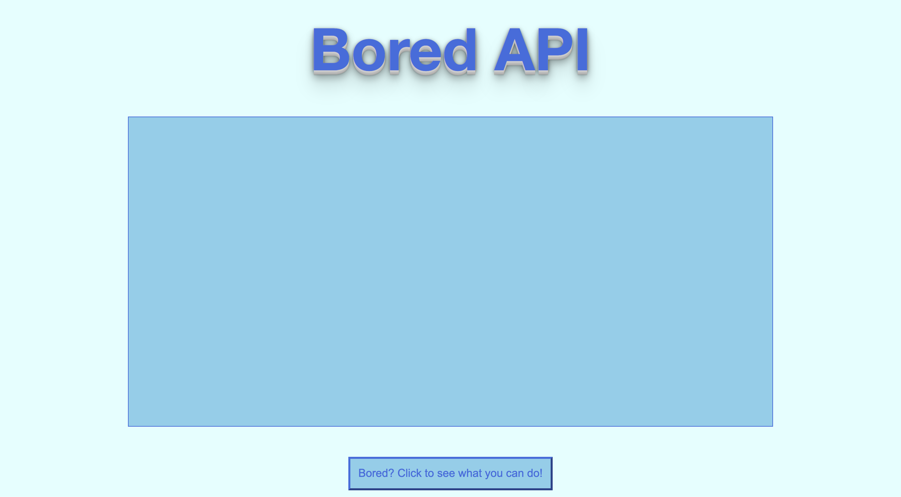
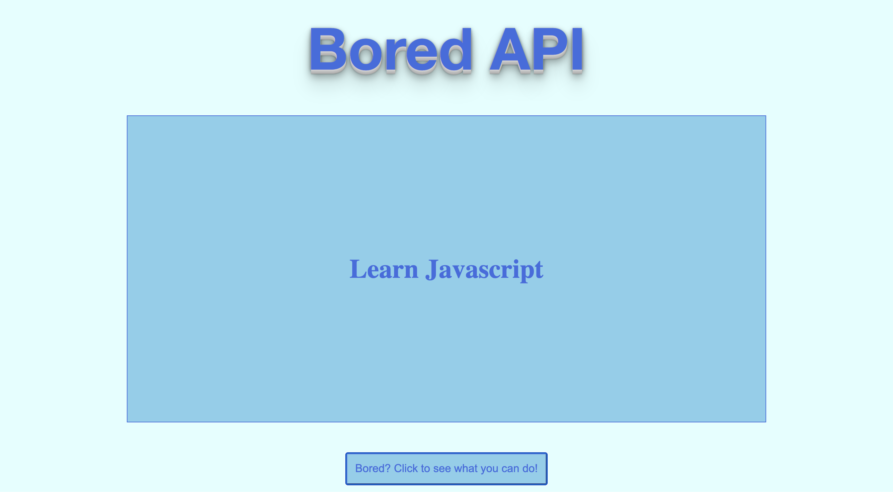

# Bored API App

## **Intro**
This app helps you find things to do when you are bored!

## **Application Screenshots**

## **Setup**

- Fork and clone this repository
- Navigate to this repository using the command line
- Run `yarn install` to install dependencies
- Run `yarn start`: to run local host: generates bundles, watches, and livereloads.
- `yarn deploy`: builds and deploys master branch
